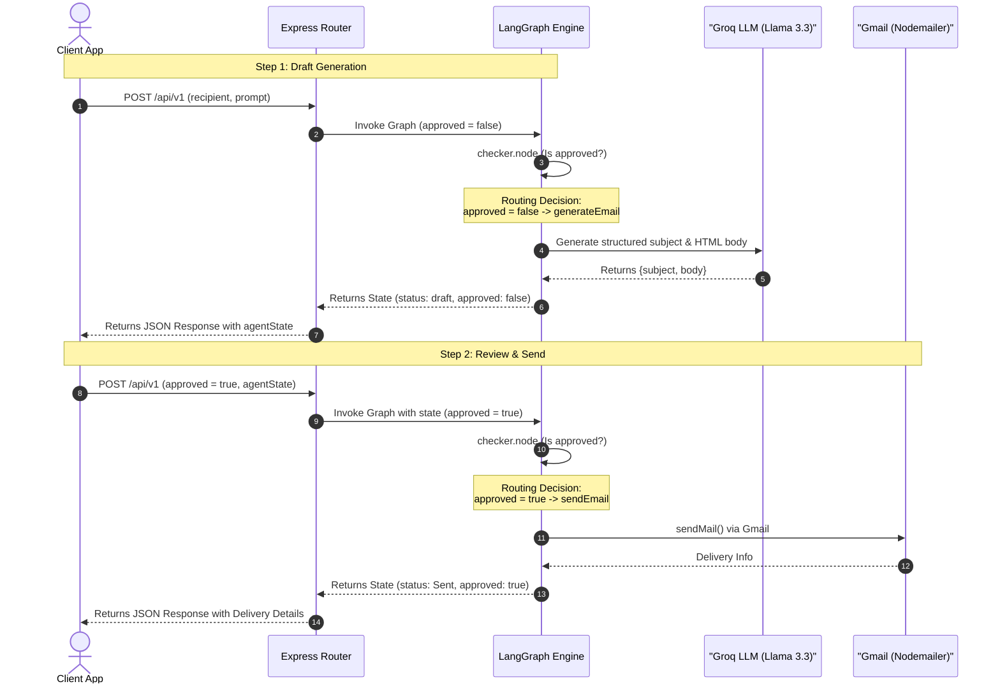

LangGraph checkpoint currently has an ESM/CommonJS issue on Vercel.
uuid is pinned to 9.0.1 via overrides to avoid runtime ERR_REQUIRE_ESM.
Do not remove without testing deployment.

# ✉️ AI Email Agent (LangGraph & Express.js)

A production-ready TypeScript microservice that uses **LangGraph**, **Groq (Llama-3.3-70b-versatile)**, and **Nodemailer** to build a structured, Human-in-the-Loop (HITL) email drafting and sending assistant.


---

## 🚀 Key Features

*   **State Graph Execution**: Orchestrated using LangChain's `@langchain/langgraph` to manage draft creation, validation, and delivery.
*   **Structured LLM Output**: Uses `@langchain/groq` combined with **Zod** to guarantee emails are generated with consistent JSON structures (`subject`, `body` in HTML format).
*   **Human-in-the-Loop Approval**: Protects your mailbox by generating drafts first, returning the execution state, and only sending when approved.
*   **Ready-to-Deploy on Vercel**: Configured for Vercel Serverless Functions out-of-the-box (`vercel.json` + `api/index.ts`).
*   **Robust Logging**: Centralized HTTP and console logging powered by `morgan` and `winston`.
*   **Prisma Support**: Preconfigured with Prisma for MongoDB integration.

---

## 📐 Architecture & Workflow

The core architecture follows a LangGraph workflow. The client initiates a draft request, gets back the draft content and state, and sends it back to approve and dispatch.



---

## 🛠️ Tech Stack

*   **Runtime**: Node.js & TypeScript
*   **Framework**: Express.js
*   **Agent framework**: `@langchain/langgraph`
*   **LLM integration**: `@langchain/groq` (`llama-3.3-70b-versatile`)
*   **Mailing client**: `nodemailer` (SMTP via Gmail)
*   **ORM**: `prisma` (MongoDB)
*   **Validation**: `zod`
*   **Logging**: `winston` & `morgan`
*   **Testing**: `jest` & `supertest`

---

## ⚙️ Environment Configuration

Create a `.env` file at the root of the project using `.env.example` as a template:

```env
PORT="5001"
NODE_ENV="dev"
MICROSERVICE_NAME="Template"
AGENT_API_KEY="your-agent-api-key"

# Database Configuration (Prisma)
DATABASE_URL="mongodb://localhost:27017/email_agent"

# LLM Provider Key (Groq)
GROQ_API_KEY="gsk_..."

# Email Provider Configuration
EMAIL_USER="your-email@gmail.com"
EMAIL_PASSWORD="your-app-password"
```

> [!TIP]
> To configure Gmail SMTP for Nodemailer, you must use a Google **App Password** rather than your actual account password. Enable 2-step verification on your Google account and generate an App Password under Security settings.

---

## 🔌 API Reference

### 1. Health Check
Checks if the microservice is active.

*   **URL**: `/healthcheck` or `/api/v1/healthcheck`
*   **Method**: `GET`
*   **Response**:
    ```json
    {
      "success": true,
      "message": "Email agent server up and running!"
    }
    ```

---

### 2. Run Agent (Draft Phase)
Generates an email draft matching the recipient and prompt requirements.

*   **URL**: `/api/v1/`
*   **Method**: `POST`
*   **Headers**:
    *   `Content-Type: application/json`
    *   `x-api-key: <your-agent-api-key>` (or `Authorization: Bearer <your-agent-api-key>`)
*   **Body Parameters**:
    *   `recipient` (string, required): Destination email address.
    *   `prompt` (string, required): Prompt describing the content/tone of the email.
    *   `attachments` (array of strings, optional): Paths or URIs to attachments.
*   **Example Request**:
    ```bash
    curl -X POST http://localhost:5001/api/v1 \
      -H "Content-Type: application/json" \
      -H "x-api-key: your-agent-api-key" \
      -d '{
        "recipient": "anuragkumartiwari12@gmail.com",
        "prompt": "Write a short friendly email asking how he is doing."
      }'
    ```
*   **Example Response**:
    ```json
    {
      "success": true,
      "message": "Agent Responded Succeddfully",
      "data": {
        "prompt": "Write a short friendly email asking how he is doing.",
        "recipient": "anuragkumartiwari12@gmail.com",
        "subject": "Checking In",
        "body": "<html><body>Dear Anurag,<br><br>I hope this email finds you well. I just wanted to reach out and see how you're doing...<br><br>Best regards,</body></html>",
        "attachments": [],
        "approved": false,
        "status": "draft"
      }
    }
    ```

---

### 3. Approve and Send Email (Delivery Phase)
Sends the generated draft after human review.

*   **URL**: `/api/v1/`
*   **Method**: `POST`
*   **Headers**:
    *   `Content-Type: application/json`
    *   `x-api-key: <your-agent-api-key>` (or `Authorization: Bearer <your-agent-api-key>`)
*   **Body Parameters**:
    *   `approved` (boolean, required): Set to `true`.
    *   `agentState` (object, required): The entire state object returned in the `data` payload of the draft request.
*   **Example Request**:
    ```bash
    curl -X POST http://localhost:5001/api/v1 \
      -H "Content-Type: application/json" \
      -H "x-api-key: your-agent-api-key" \
      -d '{
        "approved": true,
        "agentState": {
          "prompt": "Write a short friendly email asking how he is doing.",
          "recipient": "anuragkumartiwari12@gmail.com",
          "subject": "Checking In",
          "body": "<html><body>Dear Anurag,<br><br>I hope this email finds you well. I just wanted to reach out and see how you are doing...<br><br>Best regards,</body></html>",
          "attachments": [],
          "approved": false,
          "status": "draft"
        }
      }'
    ```
*   **Example Response**:
    ```json
    {
      "success": true,
      "message": "Email approved successfully",
      "data": {
        "prompt": "Write a short friendly email asking how he is doing.",
        "recipient": "anuragkumartiwari12@gmail.com",
        "subject": "Checking In",
        "body": "<html><body>Dear Anurag,<br><br>I hope this email finds you well. I just wanted to reach out and see how you are doing...<br><br>Best regards,</body></html>",
        "attachments": [],
        "approved": true,
        "status": "Sent",
        "extraInfo": {
          "accepted": ["anuragkumartiwari12@gmail.com"],
          "messageId": "<c9941b4e-35bb-2f3d-7ab9-d6ef7d60a3a6@nst.rishihood.edu.in>"
        }
      }
    }
    ```

---

## ⚡ Vercel Deployment Guide

Deploying this Express microservice as a Serverless function on Vercel is straightforward due to the pre-configured [vercel.json](file:///Users/anuragkumartiwari/Desktop/project_friday/email_agent/vercel.json) routing and the Vercel entry point at [api/index.ts](file:///Users/anuragkumartiwari/Desktop/project_friday/email_agent/api/index.ts).

### Step-by-Step Deployment

#### Option A: Deployment via Git Integration (Recommended)
1. Push your repository to **GitHub**, **GitLab**, or **Bitbucket**.
2. Go to the [Vercel Dashboard](https://vercel.com/dashboard) and click **Add New > Project**.
3. Import your repository.
4. Expand **Environment Variables** and add the following keys:
   * `GROQ_API_KEY`
   * `EMAIL_USER`
   * `EMAIL_PASSWORD`
   * `DATABASE_URL`
   * `NODE_ENV` (set to `production`)
5. Click **Deploy**. Vercel will automatically discover the `vercel.json` configuration and expose your endpoints serverlessly.

#### Option B: Deployment via Vercel CLI
1. Install the Vercel CLI:
   ```bash
   npm install -g vercel
   ```
2. Log in and deploy from the project root:
   ```bash
   vercel
   ```
3. Set your production environment variables when prompted, or configure them directly in your project settings on the Vercel Dashboard.
4. Promote the deployment to production:
   ```bash
   vercel --prod
   ```

> [!WARNING]
> Vercel's Hobby (Free) tier serverless functions have a maximum execution duration of **10 seconds**. Calling the LLM and sending mail typically takes 2–4 seconds combined, which runs well within the limits. If you anticipate larger graphs or slower network latency, you may need a Pro plan to configure higher timeouts (`maxDuration`) in `vercel.json`.

---

## 💻 Local Setup & Development

### 1. Installation
Install project dependencies:
```bash
npm install
```

### 2. Database Sync (Optional)
Generate the Prisma Client if needed:
```bash
npx prisma generate
```

### 3. Run Development Server
Start the local server with hot reloading:
```bash
npm run dev
```
The server will start on `http://localhost:5001`.

### 4. Running Tests
Execute the test suite:
```bash
npm run test
```
